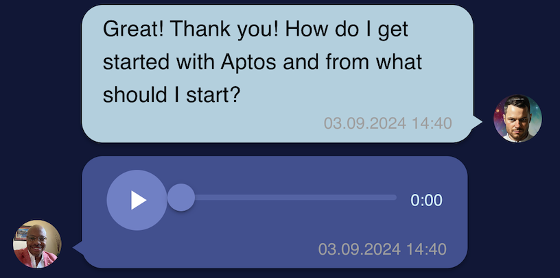

# Reconnect AI

## Character

To use the chat, you need to create a character with whom he wants to communicate. When creating it, you need to specify **a name, description, portrait, and voice sample**.

The name and description are used by language models at the first level to create a chatbot that imitates the style and manner of text communication of a specific character based on knowledge about him.

The voice sample is used to imitate this voice for voicing text messages received at the level above.

By combining the portrait and the generated voice message, we get a video response in which our character, depicted in the attached picture, moves his lips, imitating the facial expressions of a person when speaking.

The described fields are mandatory to fill in and are the minimum requirement for obtaining the expected result - a talking character.

<figure style="text-align: center;">
  
  <figcaption>Character Create Form</figcaption>
</figure>

<figure style="text-align: center;">
  
  <figcaption>Character Edit Form</figcaption>
</figure>

## Message

<figure style="text-align: center;">
  
  <figcaption>Messages</figcaption>
</figure>

The message can be text or voice. If the message is voice, then its translation into text is carried out by a separate service, for this a task is created and sent to the broker.

The answer to the message can be of 3 types: **text, audio and video**.

<figure style="text-align: center;">
  
  <figcaption>Example of text answer</figcaption>
</figure>
<figure style="text-align: center;">
  
  <figcaption>Example of audio answe</figcaption>
</figure>
<figure style="text-align: center;">
  
  <figcaption>Example of video answe</figcaption>
</figure>

## Getting Started with Create React App

This project was bootstrapped with [Create React App](https://github.com/facebook/create-react-app).

## Available Scripts

In the project directory, you can run:

### `npm start`

Runs the app in the development mode.\
Open [http://localhost:3000](http://localhost:3000) to view it in the browser.

The page will reload if you make edits.\
You will also see any lint errors in the console.

### `npm test`

Launches the test runner in the interactive watch mode.\
See the section about [running tests](https://facebook.github.io/create-react-app/docs/running-tests) for more information.

### `npm run build`

Builds the app for production to the `build` folder.\
It correctly bundles React in production mode and optimizes the build for the best performance.

The build is minified and the filenames include the hashes.\
Your app is ready to be deployed!

See the section about [deployment](https://facebook.github.io/create-react-app/docs/deployment) for more information.

### `npm run eject`

**Note: this is a one-way operation. Once you `eject`, you can’t go back!**

If you aren’t satisfied with the build tool and configuration choices, you can `eject` at any time. This command will remove the single build dependency from your project.

Instead, it will copy all the configuration files and the transitive dependencies (webpack, Babel, ESLint, etc) right into your project so you have full control over them. All of the commands except `eject` will still work, but they will point to the copied scripts so you can tweak them. At this point you’re on your own.

You don’t have to ever use `eject`. The curated feature set is suitable for small and middle deployments, and you shouldn’t feel obligated to use this feature. However we understand that this tool wouldn’t be useful if you couldn’t customize it when you are ready for it.

## Learn More

You can learn more in the [Create React App documentation](https://facebook.github.io/create-react-app/docs/getting-started).

To learn React, check out the [React documentation](https://reactjs.org/).
